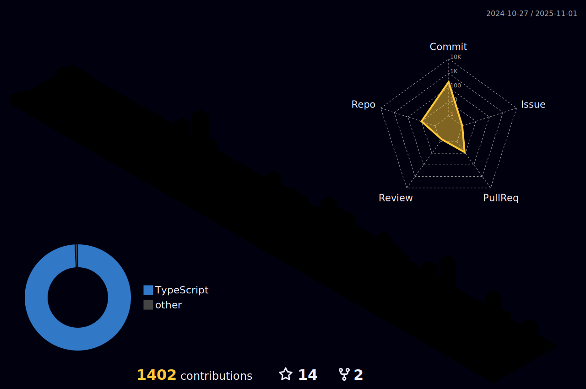

## Olá, Mundo !

#### Me chamo Vinycios Cavalcante, mas pode me chamar de "Vinny".

* Sou desenvolvedor Full Stack
* Atualmente trabalho na empresa Onebitcode como Desenvolvedor Web Pleno
* Acesse meu portfólio pessoal: [](https://vinybergamo.netlify.app)

## 📞 Contato

[](https://www.linkedin.com/in/vinybergamo/)
[](https://www.instagram.com/vinnyomaestro/)
[](mailto:vinybergamo@gmail.com)
[](https://api.whatsapp.com/send?phone=5521969790621)

## ⚙️ GitHub Analytics

<div align="center" style="display: flex; flex-direction: column; align-item:center; justify-content: center;">
    <a href="https://u8views.com/github/vinybergamo"></a>
    <div align ="center" style="display: flex;">
        <a href="https://github.com/vinybergamo">
        
        
        <p></p>
    </div>
</div>
<!--START_SECTION:waka-->

```txt
From: 17 August 2022 - To: 16 June 2024

Total Time: 1,652 hrs 55 mins

TypeScript                 1,234 hrs 13 mins██████████████████▓░░░░░░   74.67 %
JavaScript                 98 hrs          █▒░░░░░░░░░░░░░░░░░░░░░░░   05.93 %
Go                         64 hrs 20 mins  █░░░░░░░░░░░░░░░░░░░░░░░░   03.89 %
Other                      62 hrs 20 mins  █░░░░░░░░░░░░░░░░░░░░░░░░   03.77 %
JSON                       48 hrs 37 mins  ▓░░░░░░░░░░░░░░░░░░░░░░░░   02.94 %
Dart                       34 hrs 40 mins  ▓░░░░░░░░░░░░░░░░░░░░░░░░   02.10 %
Bash                       26 hrs 48 mins  ▒░░░░░░░░░░░░░░░░░░░░░░░░   01.62 %
YAML                       12 hrs 17 mins  ▒░░░░░░░░░░░░░░░░░░░░░░░░   00.74 %
Docker                     11 hrs 25 mins  ▒░░░░░░░░░░░░░░░░░░░░░░░░   00.69 %
Kotlin                     10 hrs 34 mins  ░░░░░░░░░░░░░░░░░░░░░░░░░   00.64 %
```

<!--END_SECTION:waka-->
    
## 🛠 Principais tecnologias

| Marcação/Estilização | Linguagens/Techs | Bibliotecas/Frameworks | Banco de Dados | ORM's/ODM's | Outras Ferramentas |
|---|---|---|---|---|---|
|  |  |  |  |  |  |
|  |  |  |  |  |  |
|  |  |  |  |  |  |
|  |  |  |  |  |  |
|  |  |  |  |  |  |
|  |  |  |  |  |  |
    



